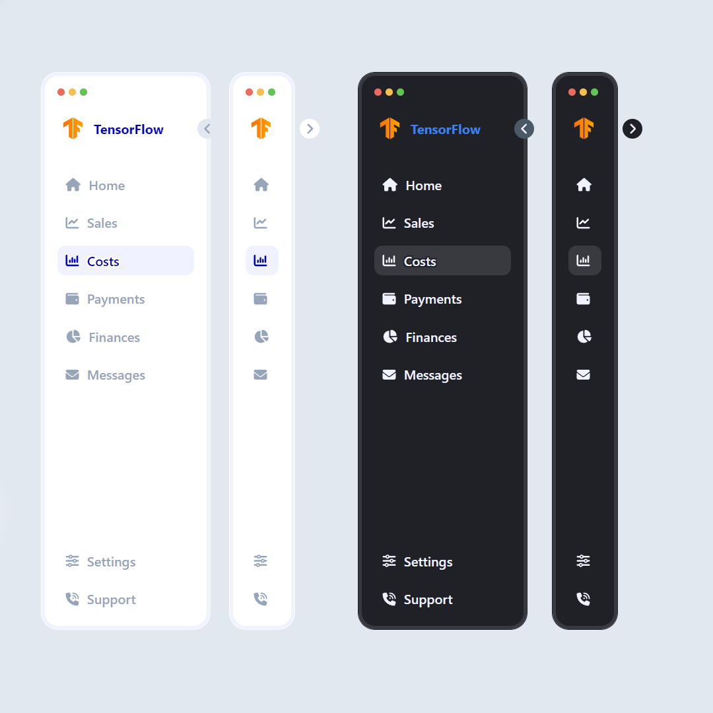

# Сайдбар

## Информация о проекте

В этом проекте я сверстал компонент Sidebar для сайта. 

<details>
<summary>Подробнее</summary>

Сайдбар может сворачиваться и разворачиваться. Есть эффекты hover и active, анимации, сопровождающие появление сайдбара и его переход из одного состояния в другое.



В проекте использовались React, sass, font-awesome, classnames.

</details>

## Инструкции по сборке и запуску

1. Склонировать себе этот репозиторий

```
git clone https://github.com/NikolaiGavrilov/Sidebar
```

2. Перейти в директорию

```
cd Sidebar
```

3. Выполнить команду ниже для установки необходимых node_modules

```
npm i
```

4. Запустить сервер разработки, выполнив в терминале команду

```
npm run dev
```

5. Перейти на сайт, кликнув по появившейся в окне терминала ссылке левой кнопкой
   мыши с зажатой клавишей Ctrl или скопировать следующую ссылку в адресную
   строку в браузере и самостоятельно выполнить переход.

```
http://localhost:5173/
```
